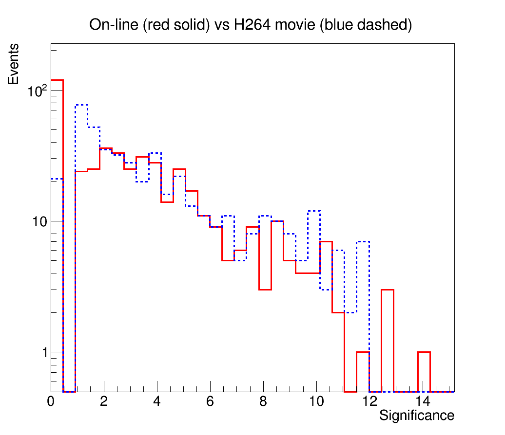

*Cosmic ray detection with USB cameras, for the CREDO project (team project)*

### Test data

*Test data recording*

[Notebook](test_data_recording.ipynb) used for data recording was based on the 
[cosmic trigger](https://github.com/zarnecki/CREDO_webcam/blob/main/examples/cosmic-trigger.ipynb) 
and [video writing](https://github.com/zarnecki/CREDO_webcam/blob/main/examples/video_save_test.ipynb)
example notebooks. It was used to record test data sets for development of the cosmic event search algorithm.

*Test data samples*

Test data samples are available on the [Faculty of Physics cloud](https://mycloud.fuw.edu.pl/index.php/s/t2TndMJa9TAyBf3). 
Data were collected with different webcams:

- Targus AVC05EU

**Background sample**: 175795 frames captured in about 14 hours. 
190 events were found with on-line algorithm (while taking data). 
Only about 20 of these are true cosmic event, rest is due to noise.
Algorithm run on the stored data found much more (966) noise-like events.
File size: 1GB.

**Signal sample**: 15052 frames captured in 36 minutes with radioactive source (caesium 137).
339 events were identified on-line, 94% of which were also found on file recorded with H264 codec.
119 additional event (mostly with low significance) were found off-line (on recorded file).
File size: about 110MB.

Plots below compare highest pixel significance for on-line analysis and recorded data. 
Good agreement is found for events with high significance, no such events are lost due to compression.

