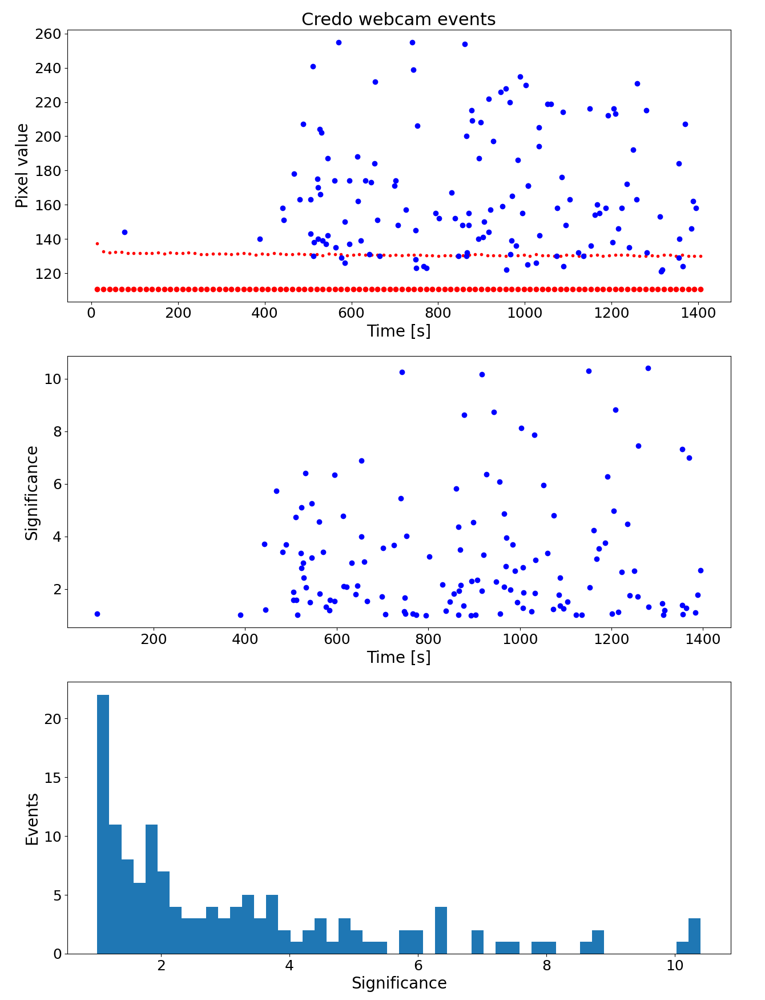

*Cosmic ray detection with USB cameras, for the CREDO project (team project)*

### Test data

*Test data recording*

[Notebook](test_data_recording.ipynb) used for data recording was based on the 
[cosmic trigger](https://github.com/zarnecki/CREDO_webcam/blob/main/examples/cosmic-trigger.ipynb) 
and [video writing](https://github.com/zarnecki/CREDO_webcam/blob/main/examples/video_save_test.ipynb)
example notebooks. It was used to record test data sets for development of the cosmic event search algorithm.

*Test data samples*

Test data samples are available on the [Faculty of Physics cloud](https://mycloud.fuw.edu.pl/index.php/s/t2TndMJa9TAyBf3). 
Data collected with different webcams are shortly described below.

---

- **Targus** (model AVC05EU)

**Background sample**: 175795 frames captured in about 14 hours. 
190 events were found with on-line algorithm (while taking data). 
Only about 20 of these are true cosmic event, rest is due to noise.
Algorithm run on the stored data found much more (966) noise-like events.
File size: 1GB.

**Signal sample**: 15052 frames captured in 36 minutes with radioactive source (caesium 137).
339 events were identified on-line, 94% of which were also found on file recorded with H264 codec.
119 additional event (mostly with low significance) were found off-line (on recorded file).
File size: about 110MB.

Plots below compare highest pixel significance for on-line analysis and recorded data. 
Good agreement is found for events with high significance, no such events are lost due to compression.

---

- **Logitech** (Era)

**Background sample**: 51675 frames captured in about 9 hours.
34 events found on-line (while taking data), 29 in off-line analysis.
File size about 472 MB.

**Signal sample**: 10033 frames captured in 86 minutes with radioactive source (caesium 137). 
112 events found on-line, 102 events found off-line.
File size about 78 MB.

Frame rate is below 2 Hz. Camera has many hot pixels, as shown on the example even below (upper plot). 
Cosmic event signature is only visible after correcting for average pixel to pixel differences (lower plot); 
event is located at at position (604,371).

---

- **TITANUM**

"Darks" (frames taken with camera lens covered) are all zeros (in most frames)!

→ online threshold level lowered (Athr = 5.)

**Background sample**: 270585 frames captured in about 12 hours (frame rate around 6 Hz).
814 events found (on-line). 
File size about 32 MB.

Events found mostly due to noise/readout errors (?) in the first image row:

But few cosmic events still visible, example below:

---

- Vakoss WS-3335

Very low level on "dark frame" (zero or single counts). 
Lower on-line threshold used (Athr = 5).

**Background sample**: 360900 frames captured in about 12 hours (frame rate about 8 Hz). 
Only 91 events found on-line (with lower threshold), 11 events with high significance threshold,
only 9 events in off-line analysis (with nominal thresholds).
File size about 1.6 GB.

Most low threshold events due to noise (?) in column 633. 
On-line event distribution on the sensor plane is shown below (open circles for low threshold, filled circles for higher one):

**Signal sample**: 4716 frames captured in about 9 minutes with small X-ray tube (rate about 8 Hz).
44 events fount on-line, most with high significance, all also identified off-line. 
Events look like particles crossing perpendicular to the sensor surface, 
all are "point like" with no elongation:

  

---

### Software performance plots

Two example plots are including below, showing the webcam performance in radiation detection. 
The observed time sequences prooves that observed are real interactions in the webcam sensors and not the webcam noise.

- **Targus** (model AVC05EU) irradiated with caesium 137 source

The source was only placed on the webcam lens cover after first 3000 frames were taken (in about 7 minutes).
Only two events were detected before the source was placed and 337 events in the rest of the run (about 29 minutes).

- **Vakoss** WS-3335 irradiated with X-ray

The webcam was placed in front of the portable X-ray tube. 
To avoid overheating, the tube is working in the "pulse" mode: 
X-ray is produced for about 40 seconds, followed by about 60 seconds of cooling time.
This structure is clearly seen in the time sequence of the detected events.

